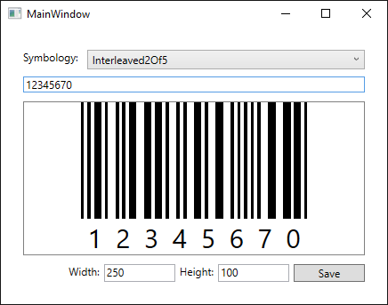
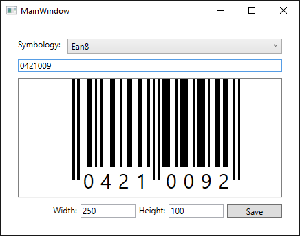
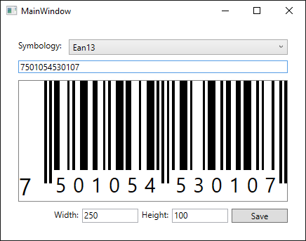
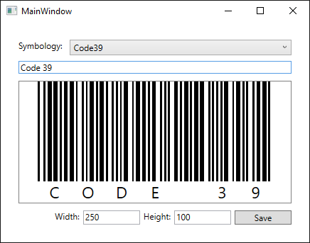

# WpfBarcode
WPF Barcode Control

This is a WPF/XAML control to generate barcodes. The following Symbologies are supported

> Interleaved 2 of 5
> Ean 8
> Ean 13
> Code 39

How to use:

    <Window x:Class="BarcodeApp.Example.Wpf.MainWindow"
        xmlns="http://schemas.microsoft.com/winfx/2006/xaml/presentation"
        xmlns:x="http://schemas.microsoft.com/winfx/2006/xaml"
        xmlns:barcode="clr-namespace:WpfBarcode;assembly=WpfBarcode">
    <Grid Margin="25">
        <barcode:Barcode Symbology="Ean13" Code="7501054530107" />
    </Grid>
      

----------
